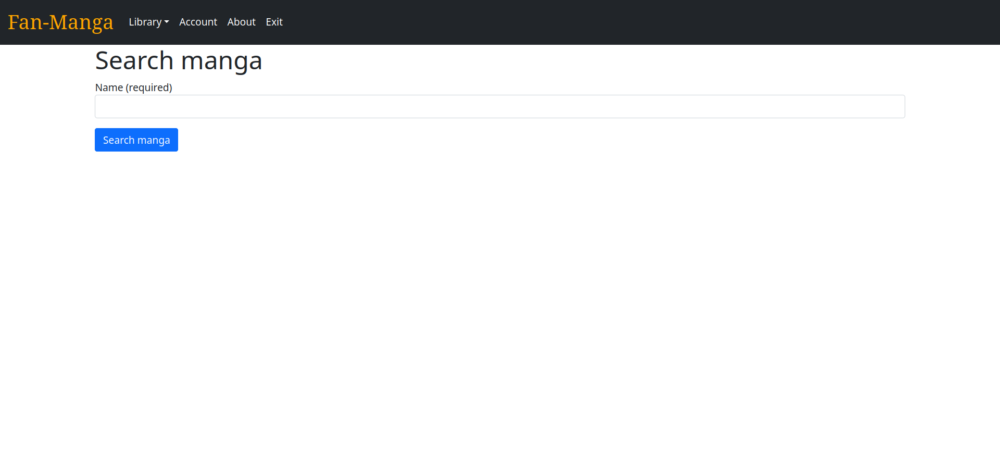

# FanManga
is a site that allows users to read, share and comment different mangas and 
comics in general. You can create your own account and posts your comics and 
comment others` creations.

# HOW TO USE
When you open the site, you get redirected to main page


You can use navigation bar to navigate on site


* Pressing the logo of site, you get redirected to main page
* Pressing the Search button redirects you to search form, where you can find
comics with requested name

* Pressing either of Popular manga/Recent manga buttons, you get redirected to
page of 10 most popular/recent updated mangas

* Pressing Account button will redirect you to your account page, if you have
logged in, or to logging page, where you can redirect to register account.


* Pressing About button redirects you to the page containing all required 
information to use the website

* Pressing Exit button logs you out of site
* Pressing Add Manga is possible only for registered users. You redirect to form
where you can upload your own manga

* If you are the owner of the manga, you can change your manga page by pressing
Change button on manga`s page


* You can add chapters by pressing Add Chapter button on manga`s page, if you 
are the owner. Be sure to add images in exact order as you want them to appear 
in manga

* Every registered user can leave comments on manga`s page. System calculates 
average user score


# INSTALLATION:
```
git clone git@github.com:IgorRazinAlex/study_python_project2.git ~/Websites/FanManga
cd ~/Websites/FanManga
chmod +x install.sh
./install
```

# RUN:
```
./run.sh
```
# NOTE:
You can change host and port for site by changing fields in 
static/json/server_data.json file. By default, it is set to create local host
